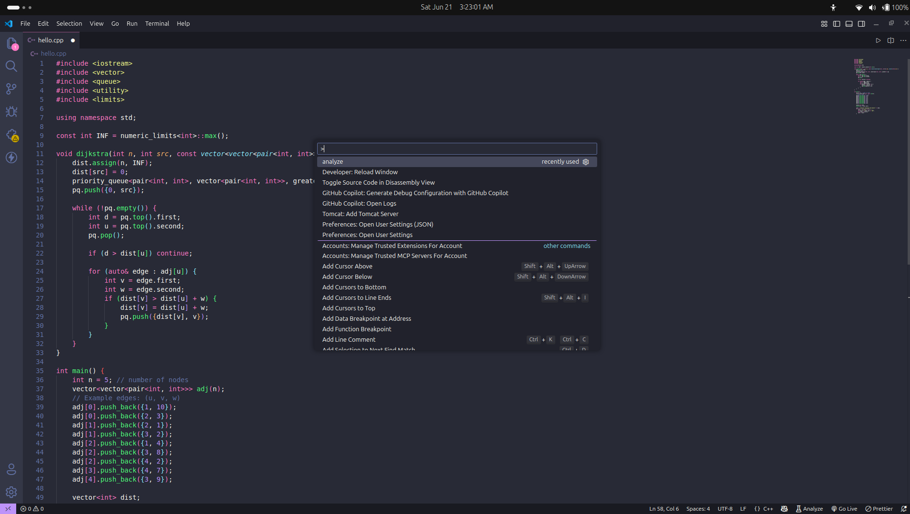
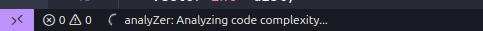
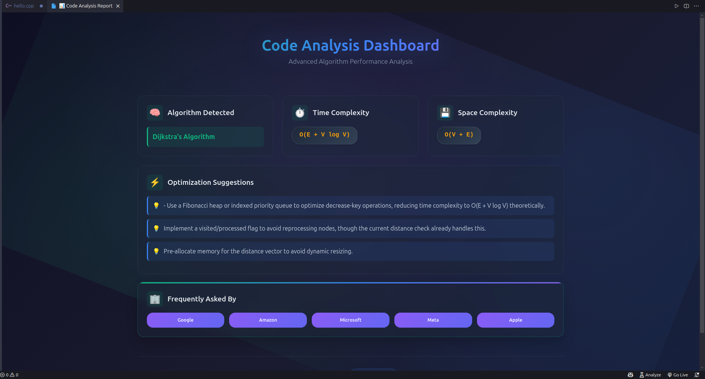
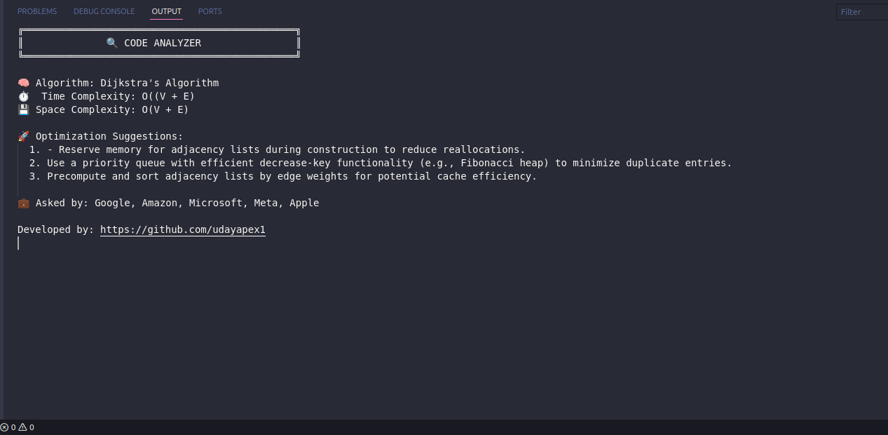
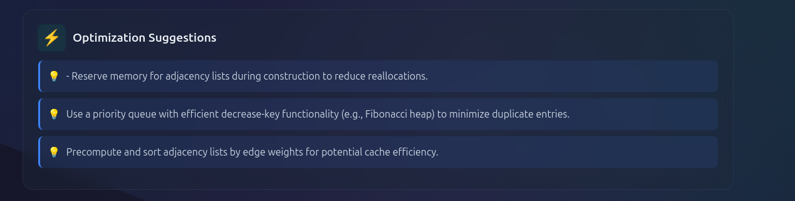
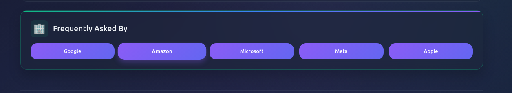

# 🔍 AnalyZer

**AI-Powered Code Complexity Analyzer for Developers**  
_A blazing-fast tool to understand what your code is doing and how to make it better._

---

## ✨ Overview

**AnalyZer** is a powerful VS Code extension that instantly analyzes your code’s **time and space complexity** using AI.  
It provides smart optimization suggestions and tags your code with **top tech company patterns** — making it perfect for interview prep, competitive coding, and writing high-performance software.

---

## 💡 Why the name “AnalyZer”?

> The bold **Z** in **AnalyZer** stands for:

- 🔁 **Z-depth**: Deep analysis from surface-level logic to low-level complexity
- ⚡ **Zoomed-in focus** on performance bottlenecks
- 🧠 **AI-powered intelligence** for smart static analysis

The **Z** symbolizes performance, intelligence, and clarity — the essence of this tool.

---

## 🚀 Features

- 📊 **Time & Space Complexity Analysis** (AI-generated)
- 🛠️ **Optimization Suggestions**
- 💼 **Company Tags** (e.g., “Asked in Google, Amazon”)
- 💬 **Motivational Developer Quotes**
- 🧩 Supports multiple languages: JavaScript, Python, C++, Java

---

## 📸 Preview

### 🔎 Real-time AI Analysis in Action

1. Open your code
2. Press `Ctrl + Shift + P` and run the command: **Analyze**
3. Wait a few seconds (cold start may take longer)

---

### 🪄 Step-by-step Visuals:

#### ▶️ Step 1: Run Command

Press `Ctrl + Shift + P`, search and run `Analyze`  


---

#### ⏳ Step 2: Wait for Analysis (Cold start may take a few seconds)



---

#### 🧠 Step 3: Get AI-based Output in Sidebar



---

#### 🖥️ Step 4: Output Panel Insights



---

### ✅ What You'll See:

#### 🧮 1. **Time & Space Complexity**


#### 🛠️ 2. **Optimization Suggestions**



#### 🏢 3. **Company Tags (Asked in MNCs)**



---

## 🛠 Usage

1. Select any code block
2. Run the command: `Analyze Complexity`
3. View real-time analysis and suggestions inside the editor & output panel

---

## 📦 Installation

Search for **AnalyZer** in the VS Code Extensions Marketplace  
or [Click Here to Install](https://marketplace.visualstudio.com/items?itemName=UdayPareta.analyzer)

```bash
# Or install via terminal
code --install-extension UdayPareta.analyzer
```
